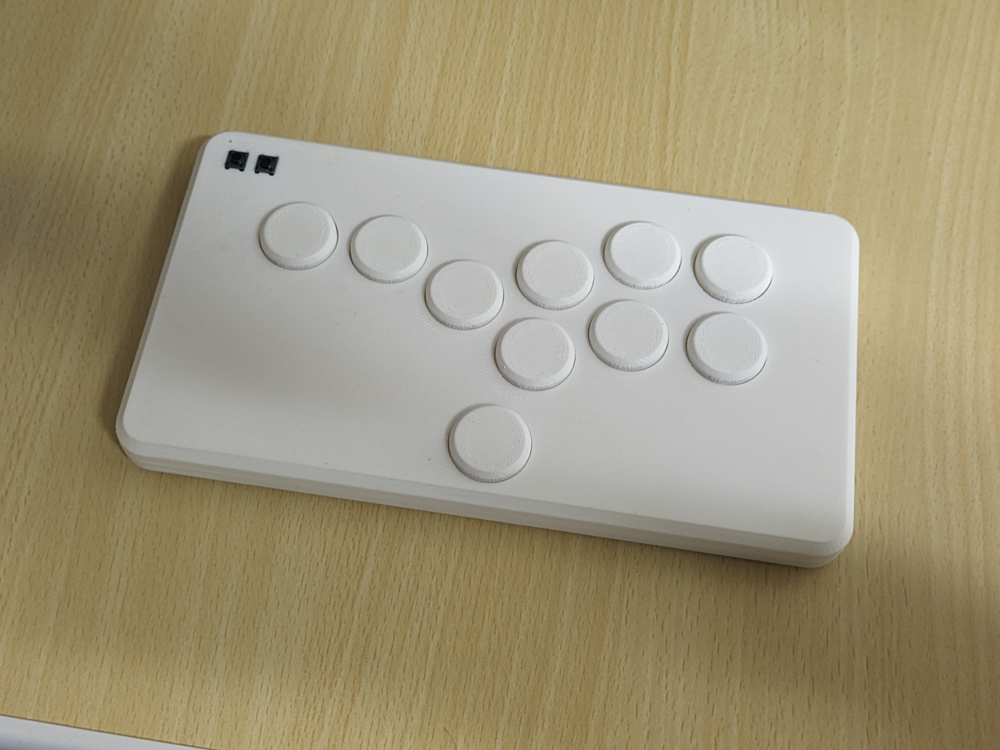

# Genjin box (6 buttons leverless)

 This is a leverless controller for the minimalist, for those who want something simple and don't need 8 or 11 buttons.

# Parts list
- [Kailh Choc v1](http://www.kailh.com/en/Products/Ks/CS/321.html)
- [waveshare rp2040 zero](https://www.waveshare.com/wiki/RP2040-Zero)
- 6x6mm tactile switch
- wire(Polyurethane copper wire recommended)
- PLA filament

# Explanation

 This model is assembled by snap-fit joints without screws. There are no obvious joints or screw holes, which is cool. Buttons are also inset and do not require the use of adhesives.

 When printing button caps, it is **strongly recommended** to slice them standing up. If printed horizontally on the bed, the joint with the keyswitch is very easy to break.

# P.S.
 If anyone wants a version with a different number of buttons or a model that does not require a tact switch, please give me a shout. I will make it.